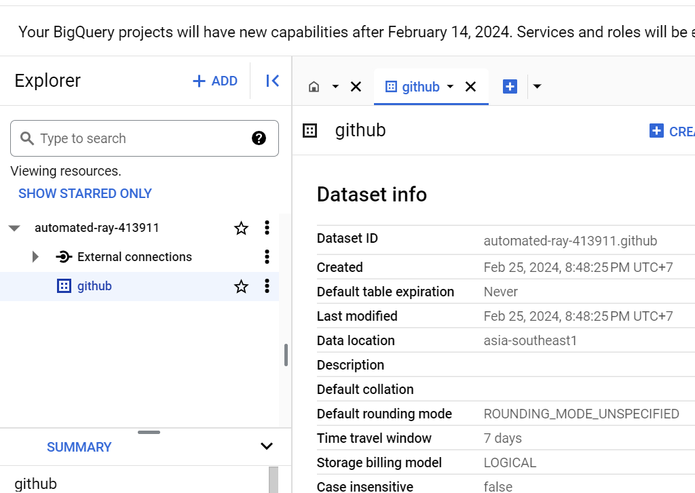
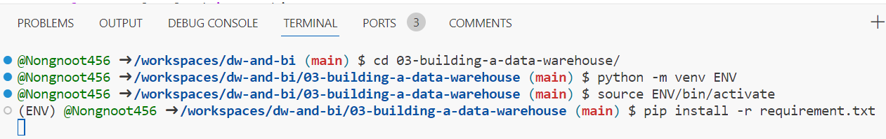
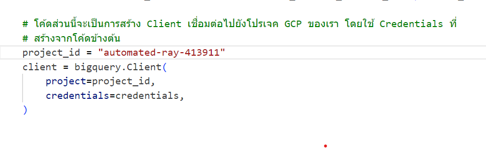
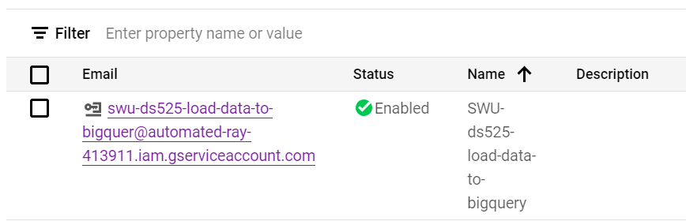
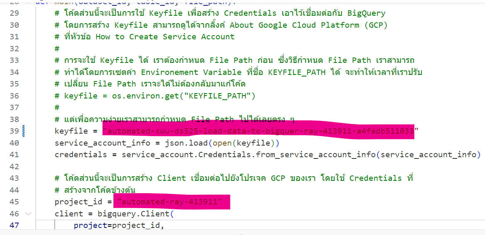

# Building a Data Warehouse
1.สร้าง Data set ชื่อ github บน bigquery

2.pip install -r requirements.txt

3. เปลี่ยนชื่อ roject_id

4. สร้าง service account บน bigquery และกำหนดสิทธิ์

5. นำไฟล์ Key ที่ download มาไว้ที่ Folder 03-building-a-data-warehouse

6. ไปที่ etl_bigquery.py แล้วนำชื่อไฟล์ Key ไปใส่ใน Key parth และใส่ชื่อ project_id ให้ตรงกับบน bigquery
